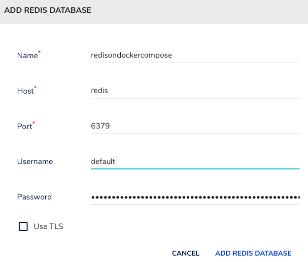

# RedisCompose
Redis and Redis-Insight docker-compose example

## Clone the repo
```
git clone https://github.com/itacirgabral/rediscompose
```

## Pull images and creates volumes
```
cd rediscompose

docker pull redis
docker pull redislabs/redisinsight

docker volume create redisdata_v001
```

## Setup your password
Edit the file `./redisconf/redis.conf`
```
requirepass 1234
```

## SElinux
If you use redhat strain
```
sudo chcon -Rt svirt_sandbox_file_t redisconf/
```

## Up & Running
```
docker-compose up --build --force-recreate -d
```

## Example redis.conf
[download.redis.io/redis-stable/redis.conf](https://download.redis.io/redis-stable/redis.conf)

## Redis Insight Add Database
